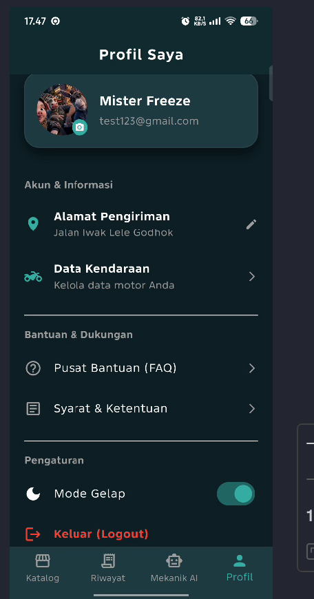
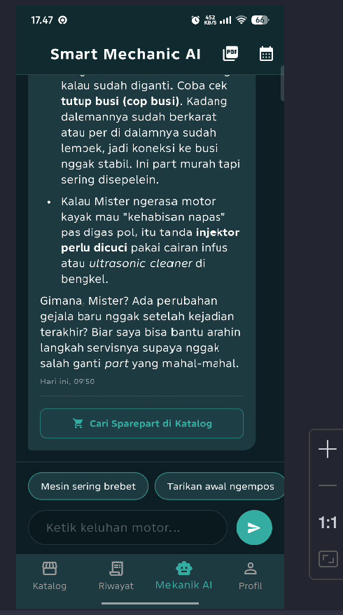

# 🏍️ GearShift — E-Commerce & Smart Mechanic

> Tugas **Final Project Mobile Development — GDGoC Unsri**

**GearShift** adalah aplikasi *mobile* berbasis Flutter yang dirancang untuk memudahkan mekanik dan penggemar otomotif dalam mencari, mendiagnosa, dan membeli komponen mesin sepeda motor secara cepat dan akurat.

Proyek ini merupakan aplikasi **fullstack mobile** kelas industri yang dibangun menggunakan pendekatan **Feature-First Clean Architecture**, pola **BLoC (Business Logic Component)** untuk manajemen status (*state management*), sistem pakar kecerdasan buatan (*AI Mechanic*), dan integrasi backend menggunakan **Supabase**. Seluruh alur logika dan antarmuka aplikasi telah divalidasi keandalannya menggunakan **Comprehensive Unit, Widget & Integration Testing**.

---

## 📑 Daftar Isi

1. [Informasi Proyek](#-informasi-proyek)
2. [Fitur Utama & Pembaruan](#-fitur-utama--pembaruan)
3. [Teknologi, Versi & Dependensi](#-teknologi-versi--dependensi)
4. [Arsitektur Aplikasi](#-arsitektur-aplikasi)
5. [Informasi Backend & Supabase](#-informasi-backend--supabase)
6. [Dokumentasi API](#-dokumentasi-api)
7. [Struktur Folder Lengkap](#-struktur-folder-lengkap)
8. [Panduan Pengujian (Testing)](#-panduan-pengujian-testing)
9. [Cara Menjalankan Proyek](#-cara-menjalankan-proyek)
10. [Konfigurasi Environment (.env)](#-konfigurasi-environment-env)
11. [Cuplikan Aplikasi (Screenshots)](#-cuplikan-aplikasi-screenshots)
12. [Standar Kontribusi (Conventional Commits)](#-standar-kontribusi-conventional-commits)
13. [Kontributor](#-kontributor)
14. [Lisensi](#-lisensi)

---

## 📌 Informasi Proyek

| Atribut | Keterangan |
|---|---|
| **Nama Proyek** | **GearShift** |
| **Deskripsi Kegiatan** | Final Project Mobile Development — GDGoC Unsri |
| **Tema** | E-Commerce Otomotif & Sistem Pakar AI |
| **Platform** | Android / iOS (Flutter) |
| **Tipe Proyek** | Fullstack Mobile Development (Flutter + Supabase) |
| **Repository Asal** | `Midterm-Mobile-Development-GDGoC-Unsri` |
| **Nama Folder Proyek** | `md_midtermproject` |

---

## ✨ Fitur Utama & Pembaruan

Aplikasi GearShift mengintegrasikan fungsionalitas perdagangan elektronik modern dengan fitur kecerdasan buatan dan validasi kualitas tinggi:

### 🤖 Smart Mechanic AI (Sistem ChatBot Diagnosa)
- **Diagnosa Keluhan Mesin:** Chatbot interaktif untuk menganalisis masalah motor (misalnya: tarikan ngempos, motor brebet, suara kasar pada CVT).
- **Format Respons Terstruktur:** Tampilan diagnosa menggunakan *rich text* Markdown (teks tebal, penomoran, dan butir daftar).
- **Quick Reply Chips:** Tombol jalan pintas untuk memilih keluhan umum tanpa perlu mengetik manual.
- **Ekspor Dokumen PDF:** Cetak ringkasan laporan diagnosa mekanik ke dokumen PDF resmi (berformat Struk Bengkel).
- **Filter Riwayat Kalender:** Menemukan kembali riwayat obrolan konsultasi berdasarkan tanggal spesifik.

### 🧪 Penjaminan Mutu & Pengujian (Automated Testing)
- **Unit Testing (BLoC):** Memverifikasi emisi *state* logika bisnis di setiap modul secara terisolasi.
- **Widget Testing:** Pengujian render antarmuka dan simulasi interaksi pengguna (tombol, *scrolling*, dan *dialog*).
- **Mocking & Offline Reliability:** Menggunakan `bloc_test` dan *fake repository* tanpa ketergantungan koneksi jaringan luar saat pengujian dijalankan.

### 🔐 Keamanan & Otentikasi
- Login & registrasi akun melalui **Supabase Auth**.
- Dukungan **Google Sign-In**.
- Modul pembantu keamanan biometrik (**Fingerprint / FaceID**).
- *Splash screen* dengan penanganan transisi dan *loading* yang aman.

### 📦 Katalog & Detail Komponen
- Etalase komponen motor real-time dari database.
- **Skeleton Shimmer Loading** untuk kenyamanan visual saat memuat data.
- Pengaturan kuantitas pembelian terisolasi melalui `quantity_bloc`.

### ❤️ Wishlist Interaktif
- Penyimpanan suku cadang impian berbasis relasi database (`*, products(*)`).
- Aksi instan: Hapus dari daftar atau langsung pindahkan ke keranjang belanja.

### 🛒 Keranjang Belanja Pintar (Smart Cart)
- **Logika Upsert:** Penggabungan otomatis kuantitas untuk produk yang sama.
- **Optimistic UI:** Pembaruan jumlah barang secara instan pada memori sebelum proses sinkronisasi background selesai.
- **Offline Cache:** Penyimpanan sesi keranjang pada memori lokal menggunakan `SharedPreferences`.

### 💳 Checkout & Manajemen Transaksi
- Sinkronisasi transaksi dengan pemotongan stok otomatis di basis data pusat.
- Pelacakan dan rekap data riwayat belanja (*Order History*).

### 🛡️ Panel Admin Khusus (CMS)
- Dashboard pengelolaan inventaris (tambah, perbarui, dan hapus suku cadang).
- Pemantauan seluruh status transaksi pengguna secara terpusat.

---

## 🛠️ Teknologi, Versi & Dependensi

### Lingkungan Pengembangan

| Komponen | Versi Acuan |
|---|---|
| Flutter SDK | `>=3.x` |
| Dart SDK | `>=3.x` |
| IDE | Android Studio / VS Code |

### Dependensi Utama (`pubspec.yaml`)

| Package | Fungsi |
|---|---|
| `flutter_bloc` | Manajemen status aplikasi berbasis BLoC pattern |
| `equatable` | Optimasi pembandingan objek dan state BLoC |
| `supabase_flutter` | SDK integrasi layanan backend Supabase |
| `dio` | HTTP Client untuk komunikasi API jaringan |
| `shared_preferences` | Penyimpanan lokal untuk preferensi tema dan keranjang |
| `cached_network_image` | Manajemen cache gambar produk dari server |
| `flutter_animate` | Animasi deklaratif pada elemen UI |
| `flutter_markdown` | Rendering format Markdown pada respons diagnosa AI |
| `pdf` & `printing` | Generator dokumen PDF dan antarmuka cetak cetak |
| `shimmer` | Efek loading skeleton placeholder |
| `google_sign_in` | Autentikasi Google |
| `local_auth` | Autentikasi keamanan perangkat keras biometrik |
| `flutter_dotenv` | Manajemen variabel rahasia pada file `.env` |
| `bloc_test` & `flutter_test` | Pengujian unit, widget, dan aliran state aplikasi |

---

## 🏛️ Arsitektur Aplikasi

Aplikasi dibangun di atas **Feature-First Clean Architecture**, memisahkan domain masalah menjadi modul mandiri dengan tiga lapisan utama:

```text
features/nama_fitur/
├── data/           → Model data, data provider, dan implementasi repository
├── domain/         → Abstraksi kontrak repository dan entity
└── presentation/   → BLoC (State/Event/Bloc) dan antarmuka UI (Pages/Widgets)
```

**Alur Aliran Data:**

```text
[UI: Page / Widget]
       │
       │ (Memicu Event)
       ▼
[BLoC: Business Logic]
       │
       │ (Memanggil Metode Abstraksi)
       ▼
[Repository: Domain Interface → Data Impl]
       │
       │ (Eksekusi Permintaan Data)
       ▼
[Supabase Client / REST API]
       │
       │ (Mengembalikan Data Model)
       ▼
[BLoC Memancarkan State Baru]
       │
       ▼
[UI Melakukan Rebuild Secara Reaktif]
```

---

## ☁️ Informasi Backend & Supabase

GearShift memanfaatkan platform **Supabase** (*PostgreSQL BaaS*) untuk mengelola penyimpanan data dan sesi pengguna secara terintegrasi.

| Layanan Supabase | Peran dalam Proyek |
|---|---|
| **Supabase Auth** | Autentikasi akun pengguna (Email & Password, Google OAuth) |
| **Supabase Database** | PostgreSQL dengan relasi data terstruktur |
| **Supabase Storage** | Penyimpanan aset gambar komponen suku cadang |
| **Row Level Security (RLS)** | Pembatasan izin akses data per tingkat pengguna |

### Skema Tabel Utama

| Tabel | Deskripsi Data |
|---|---|
| `products` | Informasi komponen: id, nama, deskripsi, harga, stok, gambar, kategori |
| `carts` | Relasi item belanja aktif pengguna (terhubung ke tabel `products`) |
| `wishlists` | Relasi suku cadang impian pengguna (terhubung ke tabel `products`) |
| `orders` | Rekapitulasi transaksi, alamat pengiriman, status pembayaran, dan total harga |
| `profiles` | Metadata pelengkap akun pengguna (nama lengkap, alamat, nomor telepon) |
| **`ai_chat_history`** | **[BARU]** Riwayat interaksi konsultasi diagnosa antara pengguna dan Mekanik AI |

---

## 📡 Dokumentasi API

Interaksi data berjalan melalui protokol REST API menggunakan Supabase Client & Dio:

| Modul | Endpoint Path | Method | Fungsi / Deskripsi |
|---|---|---|---|
| Produk | `/products?select=*` | `GET` | Memuat seluruh katalog suku cadang |
| Produk | `/products?id=eq.{id}` | `PATCH` | Sinkronisasi dan pemotongan sisa stok |
| Wishlist | `/wishlists?user_id=eq.{uid}&select=*,products(*)` | `GET` | Memuat daftar impian beserta relasi data produk |
| Keranjang | `/carts` | `POST` | Menambahkan komponen baru ke keranjang |
| Keranjang | `/carts?id=eq.{id}` | `PATCH` | Memperbarui jumlah (*quantity*) item |
| Checkout | `/orders` | `POST` | Menyimpan transaksi baru |
| AI History | `/ai_chat_history?user_id=eq.{uid}` | `GET` | Mengambil data percakapan diagnosa |

---

## 📂 Struktur Folder Lengkap

```text
md_midtermproject/
├── assets/
│   ├── images/
│   │   ├── Logoku.png                     # File logo utama aplikasi
│   │   └── Logoku1.png                    # Variasi logo aplikasi
│   └── screenshots/                       # Cuplikan antarmuka aplikasi
├── integration_test/
│   │   ├── ai_mechanic_test.dart          # Modul Smart Mechanic AI (AI Flow)
│   │   └── app_test.dart                  # Modul Test
│   │   ├── auth_test.dart                 # Modul Autentikasi (Auth Flow)
│   │   └── katalog_test.dart              # Modul Katalog & Transaksi (Katalog Flow)
├── lib/
│   ├── core/                              # Modul global yang digunakan lintas fitur
│   │   ├── config/                        # Pengaturan konfigurasi aplikasi
│   │   ├── constants/                     # Nilai konstan (warna, teks, ukuran)
│   │   ├── error/                         # Definisi exception & failure
│   │   ├── network/
│   │   │   └── dio_client.dart            # Klien HTTP kustom
│   │   ├── security/                      # Utilitas keamanan tambahan
│   │   ├── theme/
│   │   │   └── app_theme.dart             # Konfigurasi ThemeData (Dark / Light)
│   │   └── utils/
│   │       ├── biometric_helper.dart      # Autentikasi biometrik lokal
│   │       ├── format_util.dart           # [BARU] Helper format penulisan (Rupiah/Tanggal)
│   │       ├── status_util.dart           # [BARU] Helper warna & label status transaksi
│   │       └── theme_helper.dart          # Helper pengalih tema UI
│   │
│   ├── features/                          # Direktori fitur berbasis domain modul
│   │   ├── admin/                         # Modul Dashboard Pengelolaan Admin
│   │   │   └── presentation/
│   │   │       └── pages/
│   │   │           ├── admin_dashboard_page.dart
│   │   │           └── form_product_page.dart
│   │   │
│   │   ├── ai_mechanic/                   # [BARU] Modul Sistem Pakar Diagnosa & PDF
│   │   │   ├── data/
│   │   │   │   └── repositories/
│   │   │   │       └── ai_mechanic_repository.dart
│   │   │   └── presentation/
│   │   │       ├── bloc/
│   │   │       │   ├── ai_mechanic_bloc.dart
│   │   │       │   ├── ai_mechanic_event.dart
│   │   │       │   └── ai_mechanic_state.dart
│   │   │       └── pages/
│   │   │           └── ai_mechanic_page.dart
│   │   │
│   │   ├── auth/                          # Modul Otentikasi & Keamanan Sesi
│   │   │   ├── data/
│   │   │   │   ├── models/
│   │   │   │   │   └── profile_model.dart
│   │   │   │   └── auth_repository.dart
│   │   │   ├── domain/
│   │   │   └── presentation/
│   │   │       ├── bloc/
│   │   │       │   ├── auth_bloc.dart
│   │   │       │   ├── auth_event.dart
│   │   │       │   └── auth_state.dart
│   │   │       └── pages/
│   │   │           ├── login_page.dart
│   │   │           ├── register_page.dart
│   │   │           └── splash_page.dart
│   │   │
│   │   ├── cart/                          # Modul Manajemen Keranjang Belanja
│   │   │   ├── data/
│   │   │   │   └── repositories/
│   │   │   │       └── cart_repository_impl.dart
│   │   │   ├── domain/
│   │   │   │   └── repositories/
│   │   │   │       └── cart_repository.dart
│   │   │   └── presentation/
│   │   │       ├── bloc/
│   │   │       │   ├── cart_bloc.dart
│   │   │       │   ├── cart_event.dart
│   │   │       │   └── cart_state.dart
│   │   │       └── pages/
│   │   │           └── cart_page.dart
│   │   │
│   │   ├── checkout/                      # Modul Ringkasan Transaksi & Pembayaran
│   │   │   ├── data/
│   │   │   ├── domain/
│   │   │   └── presentation/
│   │   │       └── pages/
│   │   │           └── checkout_page.dart
│   │   │
│   │   ├── home/                          # Navigasi Induk Aplikasi
│   │   │   └── presentation/
│   │   │       └── pages/
│   │   │           └── main_page.dart
│   │   │
│   │   ├── order/                         # Modul Riwayat Transaksi Pesanan
│   │   │   ├── data/
│   │   │   │   └── repositories/
│   │   │   │       └── order_repository_impl.dart
│   │   │   ├── domain/
│   │   │   │   └── repositories/
│   │   │   │       └── order_repository.dart
│   │   │   └── presentation/
│   │   │       ├── bloc/
│   │   │       │   ├── order_bloc.dart
│   │   │       │   ├── order_event.dart
│   │   │       │   └── order_state.dart
│   │   │       └── pages/
│   │   │           └── order_history_page.dart
│   │   │
│   │   ├── product/                       # Modul Manajemen & Detail Suku Cadang
│   │   │   ├── data/
│   │   │   │   ├── models/
│   │   │   │   │   └── product_model.dart
│   │   │   │   └── repositories/
│   │   │   │       └── product_repository_impl.dart
│   │   │   ├── domain/
│   │   │   │   └── repositories/
│   │   │   │       └── product_repository.dart
│   │   │   └── presentation/
│   │   │       ├── bloc/
│   │   │       │   ├── product_bloc.dart
│   │   │       │   ├── product_event.dart
│   │   │       │   ├── product_state.dart
│   │   │       │   ├── quantity_bloc.dart
│   │   │       │   ├── quantity_event.dart
│   │   │       │   └── quantity_state.dart
│   │   │       ├── pages/
│   │   │       │   ├── catalog_page.dart
│   │   │       │   └── product_detail_page.dart
│   │   │       └── widgets/
│   │   │           └── product_shimmer.dart
│   │   │
│   │   ├── profile/                       # Modul Pengelolaan Data Akun Pengguna
│   │   │   ├── data/
│   │   │   │   └── repositories/
│   │   │   │       └── profile_repository_impl.dart
│   │   │   ├── domain/
│   │   │   │   └── repositories/
│   │   │   │       └── profile_repository.dart
│   │   │   └── presentation/
│   │   │       ├── bloc/
│   │   │       │   ├── profile_bloc.dart
│   │   │       │   ├── profile_event.dart
│   │   │       │   └── profile_state.dart
│   │   │       └── pages/
│   │   │           └── profile_page.dart
│   │   │
│   │   └── wishlist/                      # Modul Daftar Komponen Favorit
│   │       ├── data/
│   │       │   └── repositories/
│   │       │       └── wishlist_repository_impl.dart
│   │       ├── domain/
│   │       │   └── repositories/
│   │       │       └── wishlist_repository.dart
│   │       └── presentation/
│   │           ├── bloc/
│   │           │   ├── wishlist_bloc.dart
│   │           │   ├── wishlist_event.dart
│   │           │   └── wishlist_state.dart
│   │           └── pages/
│   │               └── wishlist_page.dart
│   │
│   └── main.dart                          # Titik masuk utama & inisialisasi dependency
│
├── test/                                  # [BARU] Rangkaian Pengujian Komprehensif (Unit & Widget Test)
│   ├── admin/
│   │   ├── admin_dashboard_widget_test.dart
│   │   └── form_product_widget_test.dart
│   ├── ai_mechanic/
│   │   ├── ai_mechanic_bloc_test.dart
│   │   └── ai_mechanic_widget_test.dart
│   ├── auth/
│   │   ├── auth_bloc_test.dart
│   │   ├── login_widget_test.dart
│   │   ├── register_widget_test.dart
│   │   └── splash_widget_test.dart
│   ├── cart/
│   │   ├── cart_bloc_test.dart
│   │   └── cart_widget_test.dart
│   ├── checkout/
│   │   └── checkout_widget_test.dart
│   ├── product/
│   │   ├── catalog_widget_test.dart
│   │   ├── product_bloc_test.dart
│   │   ├── product_detail_widget_test.dart
│   │   └── quantity_bloc_test.dart
│   ├── wishlist/
│   │   ├── wishlist_bloc_test.dart
│   │   └── wishlist_widget_test.dart
│   ├── format_util_test.dart
│   ├── order_history_widget_test.dart
│   ├── profile_bloc_test.dart
│   ├── profile_widget_test.dart
│   └── status_util_test.dart
│
├── .env                                   # Konfigurasi kredensial lokal (dikecualikan di git)
├── .gitignore                             # Aturan pengabaian pelacakan berkas Git
├── pubspec.yaml                           # Konfigurasi dependensi paket pihak ketiga
└── README.md                              # Dokumentasi teknis proyek
```

---

## 🧪 Panduan Pengujian (Testing)

Seluruh pengujian unit dan widget dibangun agar dapat dieksekusi secara instan dan mandiri tanpa memerlukan jaringan internet atau ketersediaan server langsung (*Mock Environment*).

Jalankan seluruh rangkaian tes proyek dengan satu perintah:
```bash
flutter test
```

Untuk menguji direktori modul tertentu secara terpisah:
```bash
# Pengujian modul AI Mechanic
flutter test test/ai_mechanic/

# Pengujian modul Keranjang
flutter test test/cart/

# Pengujian modul Katalog Produk
flutter test test/product/
```

---

## 🚀 Cara Menjalankan Proyek

### 1. Prasyarat Sistem
- **Flutter SDK** versi 3.x telah terkonfigurasi pada path environment.
- Emulator Android / iOS Simulator atau perangkat fisik aktif.

### 2. Kloning Repository
```bash
git clone https://github.com/TatangBae16/Final-Project-Mobile-Development-GDGoC-Unsri.git
cd nama-direktori-anda
```

### 3. Pasang Dependensi
```bash
flutter pub get
```

### 4. Konfigurasi Environment
Buat berkas `.env` pada direktori root proyek (sejajar dengan `pubspec.yaml`) sesuai panduan di bawah.

### 5. Eksekusi Aplikasi
```bash
flutter run
```

---

## 🔑 Konfigurasi Environment (.env)

Buat file bernama `.env` pada root direktori:

```env
SUPABASE_URL=https://proyek-anda.supabase.co
SUPABASE_ANON_KEY=kunci-anon-supabase-anda
MIDTRANS_SERVER_KEY=kunci-server-midtrans-anda
GEMINI_API_KEY=kunci-api-gemini-anda
```

---

## 🖼️ Cuplikan Aplikasi (Screenshots)

### 👤 Tampilan Pengguna (User)

| Halaman Login | Katalog Produk | Detail Produk |
|:---:|:---:|:---:|
|  |  |  |

| Halaman Wishlist | Keranjang Belanja | Checkout |
|:---:|:---:|:---:|
|  |  |  |

| Riwayat Transaksi | Profil Pengguna | Mekanik AI & PDF |
|:---:|:---:|:---:|
|  |  |  |

### 🛡️ Tampilan Admin

| Dashboard Admin | Form Kelola Suku Cadang | Seluruh Transaksi Toko |
|:---:|:---:|:---:|
|  |  |  |

---

---

## Hasil Testing (Screenshots)

### Widget & Unit Testing

|                            Widget & Unit Testing                             |
|:----------------------------------------------------------------------------:|
|  |

### Integration Testing

|                             Auth Integration Testing                             |                              Katalog Integration Testing                               |                                 Ai Mechanic Integration Testing                                  |
|:--------------------------------------------------------------------------------:|:--------------------------------------------------------------------------------------:|:------------------------------------------------------------------------------------------------:|
|  |  |  |

---

## 📝 Standar Kontribusi (Conventional Commits)

Seluruh riwayat komit mengikuti konvensi **Conventional Commits**:

Format: `<tipe>(<lingkup opsional>): <deskripsi singkat>`

| Tipe | Makna Perubahan | Contoh |
|---|---|---|
| `feat` | Penambahan fitur baru | `feat(ai_mechanic): tambahkan integrasi cetak laporan PDF` |
| `fix` | Perbaikan bug/kendala kode | `fix(cart): atasi timeout animasi cached network image` |
| `test` | Penambahan atau pembaruan pengujian | `test(product): lengkapi widget test untuk katalog dan detail` |
| `refactor` | Perapian kode tanpa mengubah fungsionalitas | `refactor(auth): pisahkan abstraksi login ke interface` |
| `docs` | Pembaruan dokumentasi proyek | `docs(readme): perbarui arsitektur folder dan panduan test` |
| `chore` | Penyesuaian konfigurasi atau dependensi | `chore: sinkronisasi pubspec lock` |

---

## 👤 Kontributor

| Nama Lengkap | Nomor Induk Mahasiswa (NIM) | Peran Proyek |
|---|---|---|
| **TARUNA RAJASA IRYAWAN** | **09021282328071** | Fullstack Mobile Developer |

---

## 📄 Lisensi

Proyek ini dikembangkan sebagai karya evaluasi kompetensi akademik pada kegiatan Final Project Task **Mobile Development GDGoC Universitas Sriwijaya**. Seluruh hak cipta kode dan implementasi dilindungi untuk kebutuhan edukasi.
